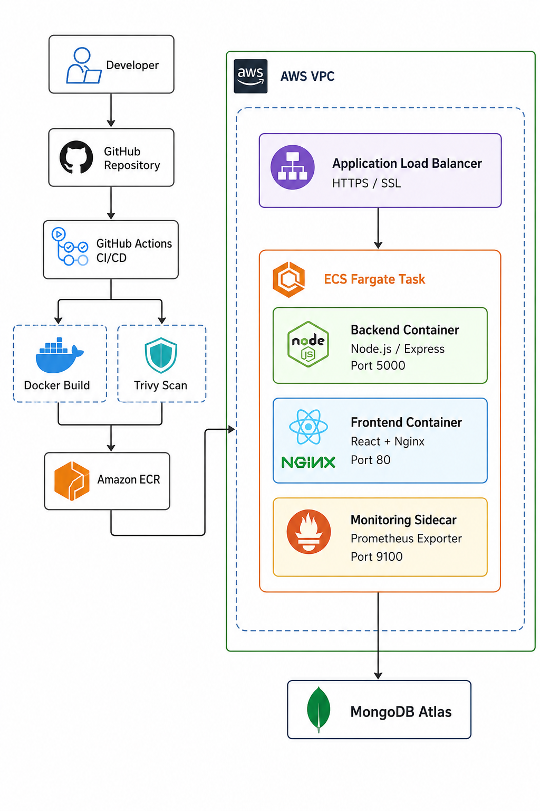

# 🌿 HealthMattersHub

<div align="center">

## Production-Grade Full-Stack Health Platform

A complete DevOps implementation featuring Docker, Terraform, AWS Infrastructure, CI/CD Automation, Security Scanning and Observability.

</div>

---

## 📌 Project Overview

HealthMattersHub is a full-stack health blogging platform built with modern development and DevOps practices.

The project demonstrates a complete production-style workflow:

- Containerized application development
- Automated CI/CD pipelines
- Infrastructure as Code
- Cloud networking
- Secure deployment practices
- Monitoring and observability
- Automated security scanning

The application domain is registered through **AfeezHost** and connected to the deployed application environment.

---

# 🏗️ Architecture




## High-Level Flow

```
Developer
     |
     v
GitHub Repository
     |
     v
GitHub Actions CI/CD
     |
     +--------------------+
     |                    |
     v                    v
  Docker Build        Trivy Scan
                           |
                           v
                     Amazon ECR
                           |
                           v

                    AWS VPC

        +--------------------------------+
        |                                |
        | Application Load Balancer      |
        | HTTPS / SSL                    |
        |                                |
        +---------------+----------------+
                        |
                        v

                 ECS Fargate Task

        +-------------------------------+
        |                               |
        | Backend Container             |
        | Node.js / Express             |
        | Port 5000                     |
        |                               |
        | Frontend Container            |
        | React + Nginx                 |
        | Port 80                       |
        |                               |
        | Monitoring Sidecar            |
        | Prometheus Exporter           |
        | Port 9100                     |
        |                               |
        +-------------------------------+

                        |
                        v

                MongoDB Atlas

```

---

# 🛠️ Technology Stack

## Application

| Component | Technology |
|---|---|
| Frontend | React 18 |
| Routing | React Router |
| Backend | Node.js + Express.js |
| Database | MongoDB Atlas |
| ODM | Mongoose |
| Authentication | JWT + bcrypt |
| Uploads | Multer |
| Validation | express-validator |
| Security | Helmet, Rate Limiting, Mongo Sanitization |


## DevOps & Cloud

| Technology | Purpose |
|---|---|
| Docker | Containerization |
| Docker Compose | Local orchestration |
| Nginx | Reverse proxy |
| Terraform | Infrastructure as Code |
| GitHub Actions | CI/CD automation |
| Trivy | Container security scanning |
| Amazon ECR | Container registry |
| ECS Fargate | Serverless container deployment |
| ALB | Load balancing + SSL |
| ACM | SSL certificates |
| VPC | Network isolation |
| IAM | Access control |
| SSM Parameter Store | Secrets management |
| CloudWatch | Logs and monitoring |
| Prometheus | Metrics collection |
| Grafana | Dashboard visualization |

---

# 📁 Project Structure

```
healthmattershub.com/

├── .github/
│   └── workflows/
│       ├── ci.yml
│       └── cd.yml
│
├── backend/
│   ├── Dockerfile
│   ├── server.js
│   ├── controllers/
│   ├── models/
│   ├── routes/
│   │   ├── health.js
│   │   └── metrics.js
│   └── middleware/
│
├── frontend/
│   ├── Dockerfile
│   ├── nginx.conf
│   └── src/
│
├── nginx/
│
├── monitoring/
│   ├── prometheus.yml
│   └── grafana/
│
├── terraform/
│   ├── main.tf
│   ├── variables.tf
│   ├── outputs.tf
│   └── modules/
│
├── docs/
│   ├── architecture.png
│   └── screenshots/
│
├── docker-compose.yml
├── README.md
└── ARCHITECTURE.md
```

---

# 🚀 Running Locally

## Requirements

Install:

- Node.js 18+
- Docker
- Docker Compose
- MongoDB Atlas Account


## Clone Repository

```bash
git clone https://github.com/UvereAnn/healthmattershub.com.git

cd healthmattershub.com
```

---

## Environment Setup

Backend:

```bash
cp backend/.env.example backend/.env
```

Frontend:

```bash
cp frontend/.env.example frontend/.env
```

---

## Start Application

Run:

```bash
docker compose up --build
```

Services:

| Service | URL |
|---|---|
| Frontend | http://localhost |
| Backend API | http://localhost:5000 |
| Prometheus | http://localhost:9090 |
| Grafana | http://localhost:3001 |

---

# 🔐 Security Implementation

Security controls implemented:

✅ Docker image scanning with Trivy  
✅ CRITICAL vulnerability blocking  
✅ JWT authentication  
✅ Password hashing with bcrypt  
✅ Helmet security headers  
✅ API rate limiting  
✅ Input validation  
✅ MongoDB injection prevention  
✅ Non-root containers  
✅ Private subnet deployment  
✅ IAM least privilege access  
✅ Secure secrets handling  

---

# 📊 Monitoring & Observability

Application metrics are exposed through:

```
Application
      |
      v
/api/metrics
      |
      v
Prometheus
      |
      v
Grafana
```

Tracked metrics:

- HTTP request count
- Response duration
- Error rate
- Active connections
- Node.js memory usage
- Event loop performance

---

# ☁️ Infrastructure

Infrastructure is managed using Terraform.

Created resources include:

- AWS VPC
- Public and private subnets
- NAT Gateway
- Application Load Balancer
- ECS Cluster
- ECS Fargate services
- ECR repositories
- IAM roles
- Security Groups
- SSM parameters
- CloudWatch logs


Infrastructure can be recreated using:

```bash
cd terraform

terraform init

terraform plan

terraform apply
```

---

# 🚢 CI/CD Pipeline

Every deployment follows this workflow:

```
Code Push

     |
     v

GitHub Actions

     |
     +----------------+
     |                |
    CI               CD

Validate         Build Images
Test             Scan Images
Build            Push to ECR

                     |
                     v

              Update ECS

                     |
                     v

              Deploy New Version

                     |
                     v

              Health Verification
```

---

# ❤️ Health Endpoint

The application includes a health check endpoint:

```
GET /api/health
```

Used for:

- Load balancer checks
- Deployment verification
- Service availability monitoring

---

# 🐳 Container Architecture

The ECS task runs multiple containers:

```
ECS Task

├── Backend Container
│      Node.js API
│      Port 5000
│
├── Frontend Container
│      React + Nginx
│      Port 80
│
└── Monitoring Sidecar
       Prometheus exporter
       Port 9100
```

The sidecar pattern separates monitoring responsibilities from application code while keeping the containers in the same task environment.

---

# 🔑 Secrets Management

Sensitive information is never stored in source code.

Development:

```
.env files
```

CI/CD:

```
GitHub Secrets
```

Runtime:

```
AWS SSM Parameter Store
```

Secrets are injected into containers securely during deployment.

---

# 🧠 Architecture Decisions

Detailed engineering decisions are documented here:

[📘 Read the Architecture Documentation](ARCHITECTURE.md)

Includes:

- Why AWS Fargate
- Why Terraform
- Why GitHub Actions
- Why Trivy
- Why MongoDB Atlas
- Why Sidecar Monitoring

---

# 📈 Future Improvements

Potential improvements:

- CloudFront CDN
- AWS WAF
- Blue/Green deployments
- Advanced alerting
- Distributed tracing
- Database scaling strategy


---

# 👨‍💻 Skills Demonstrated

✅ Docker multi-stage builds  
✅ Docker Compose  
✅ Nginx reverse proxy  
✅ React + Node.js development  
✅ AWS ECS Fargate  
✅ Amazon ECR  
✅ Terraform IaC  
✅ GitHub Actions CI/CD  
✅ Trivy security scanning  
✅ Prometheus monitoring  
✅ Grafana dashboards  
✅ IAM security  
✅ Cloud networking  
✅ Secure deployment practices  


---

<div align="center">

Built as a complete DevOps portfolio project 🚀

</div>